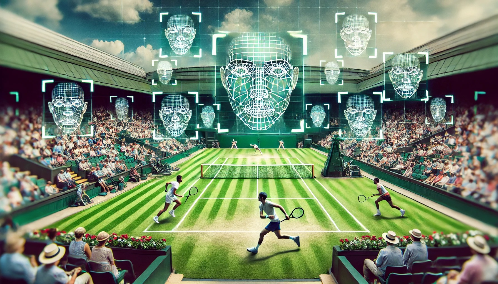
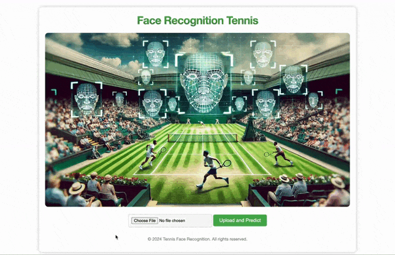

# Tennis Face Recognition App

This project is a Face Recognition App specifically designed for recognizing tennis players. The app uses two different methods for face recognition: a Deep Learning model based on `FaceNet` and `compare_faces` from the `face_recognition` library. The app includes tools for downloading images from Google Images, preprocessing and filtering outliers, model training, prediction, and deployment using `Docker` and `Flask API`.



## Table of Contents

- [Demo](#demo)
- [Features](#features)
- [Installation](#installation)
- [Usage](#usage)
    - [Data Loader](#data-loader)
    - [Image Preprocessing](#image-preprocessing)
    - [Model Training](#model-training)
    - [Model Predictor](#model-predictor)
    - [App Deployment](#app-deployment)


## Demo

### Inputting a valid tennis player image
This is what the app looks like when inputting a tennis player that the model is familiar with: 


### Inputting a random image
And this is how the model will react if we put a random person, like Neymar Jr., into the app: 



## Features

- Download images from tennis players using Google Images crawler;
- Preprocess images and filtering out outliers and images with multiple faces;
- Train models using two different methods: `compare_faces` and a Deep Learning model using transfer learning based on FaceNet;
- Predict faces using the trained models;
- Deploy the app using Docker and Flask with a web interface.

## Installation

### Prerequisites

- [Conda](https://docs.conda.io/en/latest/)
- [Docker](https://www.docker.com/)

### Step-by-Step Guide

1. **Clone the repository:**
    ```sh
    git clone https://github.com/iglesiascaio/tennis_face_recognition.git
    cd tennis_face_recognition
    ```

2. **Create and activate the Conda environment:**
    ```sh
    make create-env
    ```

3. **Activate the environment and install dependencies:**
    ```sh
    . ./activate
    ```

## Usage

### Data Loader

The data loader uses a Google Images crawler to download images of tennis players. You can customize the players and the number of images in the `data_loader.py` file. You can also choose the players to download images using the `config/data-loader.yaml` file. 

```sh
python runner/data_loader.py
```


### Image Preprocessing

Preprocess images and filter out outliers, images with multiple faces, and other unwanted data. The preprocessing script can be found in `image_preprocessing.py`.

```sh
python runner/image_preprocessing.py
```


### Model Training

To train the face recognition models, you can use the provided script with Click for command-line argument parsing. The training process involves two main components: computing distances between face encodings and training a deep learning model based on FaceNet. We also use the `ImageDataGenerator` from TensorFlow in order to dynamically generate images that avoid overfitting. 

To train the models, use a command like this one:

```sh
python runner/model_training.py --data-dir ./data/preprocessed_images --model-save-path ./model/face_recognition_model_all --encodings-save-path ./model/face_encodings.pkl --img-size 160,160 --batch-size 32 --epochs 100
```

Parameters
- --data-dir: Directory containing preprocessed images (default: ./data/preprocessed_images).
- --model-save-path: Path to save the trained model (default: ./model/face_recognition_model_all).
- --encodings-save-path: Path to save the face encodings (default: ./model/face_encodings.pkl).
- --img-size: Desired size for resizing the images (default: 160,160).
- --batch-size: Batch size for training (default: 32).
- --epochs: Number of epochs for training (default: 100).

### Model Prediction

To predict the tennis players using the face recognition models, you can use the provided script with Click for command-line argument parsing. The prediction process involves detecting and preprocessing the face, then using either the compare_faces method or a deep learning model based on FaceNet to make predictions - or a combination of the two methods. 

To predict a series of player to test your model, use a command like this one:

```sh
python runner/model_predict.py --model-path ./model/face_recognition_model_all --encodings-path ./model/face_encodings.pkl --to-predict-path ./data/to_predict --img-size 160,160
```

Parameters
- --model-path: Path to the saved model (default: ./model/face_recognition_model_all).
- --encodings-path: Path to the saved face encodings (default: ./model/face_encodings.pkl).
- --to-predict-path: Directory containing images to predict (default: ./data/to_predict).
- --img-size: Desired size for resizing the images (default: 160,160).

The script will load the saved model and face encodings, then run predictions on the images in the specified directory using the chosen method (default = "combined").

### App Deployment

Deploy the app using Docker and Flask. The interface is built using HTML and CSS.

#### Step-by-Step Guide

1. Make sure Docker is installed and running on your machine.

2. Navigate to the Project Directory and build the Docker Image. This command will create a Docker image named face_recognition_flask:

```sh
docker build -t face_recognition_flask .
```

3. Run the Docker container to start the Flask app. This command maps port 5001 on your local machine to port 5000 in the Docker container:
```sh
docker run -p 5001:5000 face_recognition_flask
```

4. Open a web browser and go to http://localhost:5001 to access the app. You should see the home page of your face recognition tennis app.


This setup ensures that the app is containerized, making it easier to deploy and manage.


Copyright © 2024 by Caio Iglesias. All rights reserved


